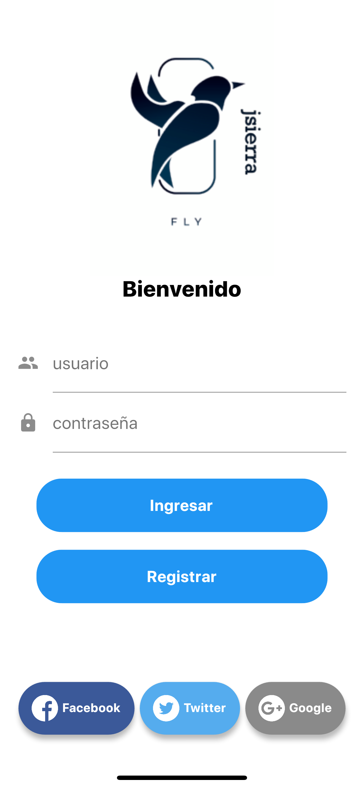
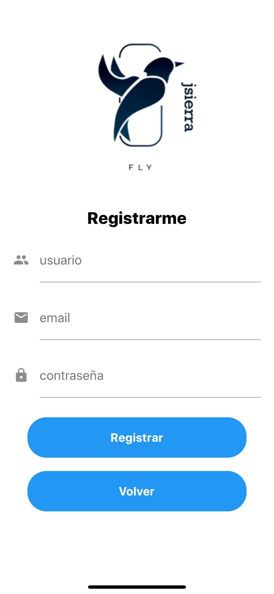
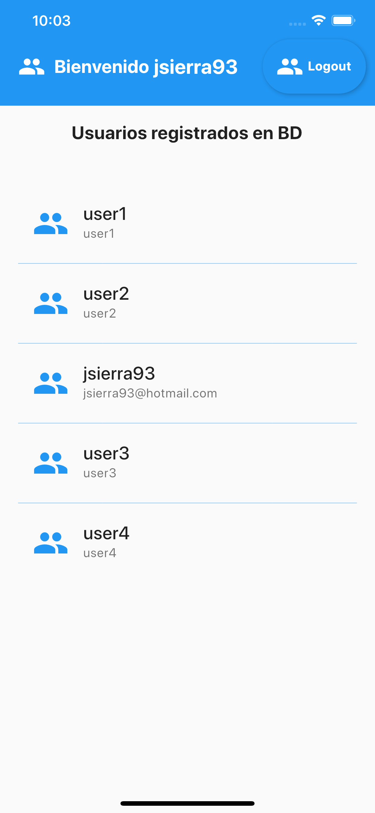

# Sqlite flutter

 App login y registro de usuarios en BD local (Sqlite)

## Fuentes oficiales

https://flutter-es.io/docs/get-started/install

https://flutter.dev/

### Screenshot

 

 
 

 
 

 
  https://github.com/jsierra93
